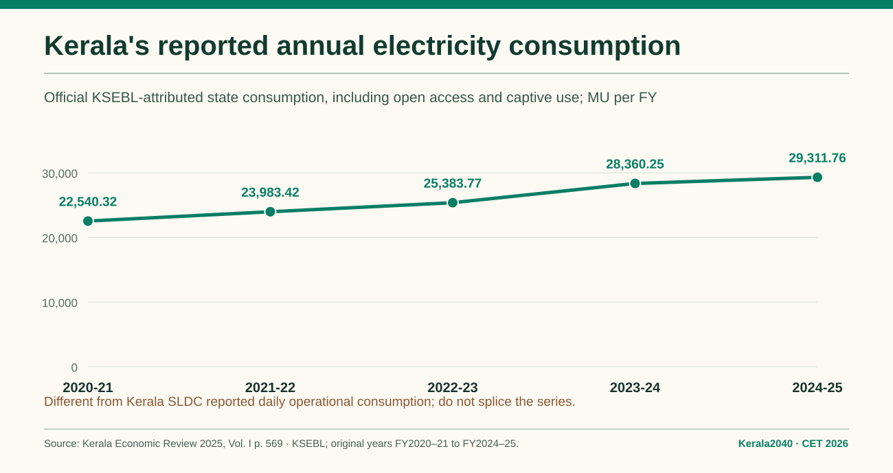
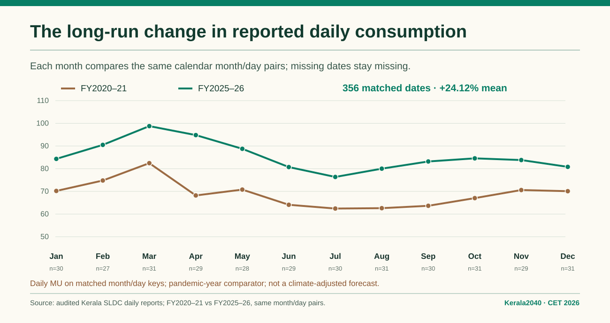
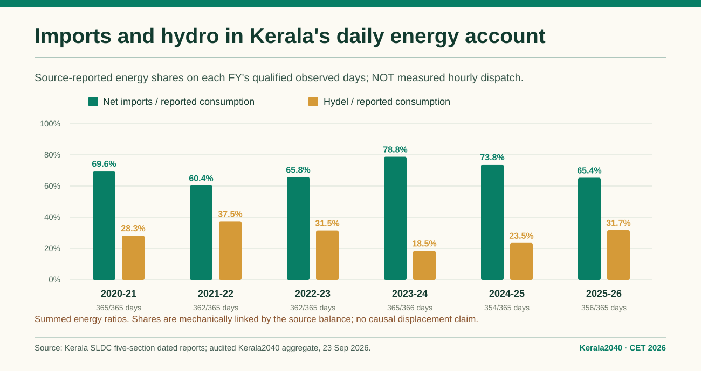
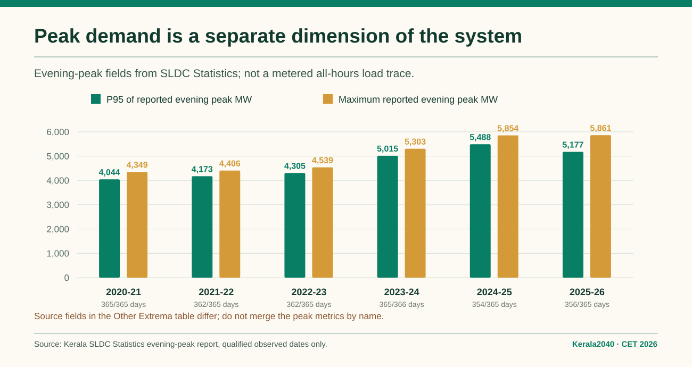

# Kerala2040 · Historical electricity story for CET 2026

**Executed synthesis · 24 September 2026.** Question: **How has Kerala's electricity consumption and import dependence changed, and what do the observed records show about hydro's role?**

**Evidence boundaries:** (A) Kerala State Planning Board, *Economic Review 2025*, Vol. I, pp. **568–569**, KSEBL-attributed **annual consumption** FY2020–21 through FY2024–25; Vol. II Appendix 11.2.2/11.2.3 for distinct KSEBL sales/accounting definitions; (B) Kerala2040's **source-dated daily SLDC five-section reports** collected **2019-08-06–2026-09-23**, source-hash/date audited and privately curated. Annual official and daily operational populations **must not be subtracted or merged into a single historic demand series**. Aggregates and exact chart inputs: [machine-readable CET register](../data/evidence/sldc/cet_historical_electricity_story_2026_09_24.json), itself derived from the frozen [SLDC advanced aggregate](../data/evidence/sldc/sldc_daily_advanced_aggregate_2026_09_23.json). Source archive SHA-256 `2d55fefdcbfcacf7f753cebb0c429479abb6ea5eedb2533297a455735b6bfc3f`.

## Conference-safe headline findings

**1. Official annual electricity consumption grew across five reported financial years.** In Kerala's KSEBL-attributed *consumer-side state consumption* series, FY2020–21 is **22,540.32 MU**, FY2023–24 **28,360.25 MU** and FY2024–25 **29,311.76 MU**, an increase of **30.04% from FY2020–21 to FY2024–25**. The FY2024–25 year-on-year change is **3.36%**, per the Economic Review. This annual scope **includes open-access consumption and consumption against captive generation**; it is not summed SLDC daily load.

**2. Same-calendar-day SLDC comparisons show longer-run growth but little recent net change.** On **356 common month/day keys**, the mean reported *daily operational* consumption changes **68.88173 → 85.49493 MU/day**, or **+24.1184%**, FY2020–21 to FY2025–26. This comparator begins in a pandemic-affected FY; do not treat it as a causal or temperature-adjusted trend. On **355 matched dates**, FY2023–24 to FY2025–26 is **+1.1671%**; on **345 matched dates**, FY2024–25 to FY2025–26 is **−1.2792%**. Those are **three distinct paired-day populations**. They do not establish an annual energy decline, and missing days are never filled.

**3. Reported net import and hydel shares vary materially; the source balance links them.** Energy-weighted **net imports / reported consumption** across each FY's qualified observed days: **60.4% FY2021–22 → 78.8% FY2023–24 → 65.4% FY2025–26**. The corresponding **hydel / reported consumption** shares are **37.5% → 18.5% → 31.7%**. This is descriptive reporting of Kerala's supply composition across *different observed-day populations*. Because the reported internal generation plus net imports approximately equals consumption by construction, the inverse movement is **not independent proof that additional hydro causally displaced imports**, nor proof of firm transfer capability or imports' cost.

**4. Peak burden is not captured by annual energy or daily averages.** Among **source Statistics evening peak** records, FY2020–21 P95 is **4,044 MW**, FY2025–26 P95 **5,177 MW**, with maxima **4,349** and **5,861 MW** respectively. The archive-wide **6,195 MW on 23 April 2026** is in *partial* FY2026–27, and the source *Others* evening-extrema field has **5,950 MW** for that date. These are **separately named metrics**; the reported points do not supply an hourly/15-minute demand chronology.

## Audit table — strictly the *daily operational* SLDC population

Each year below uses its own **qualified source days**. The means and shares are **not full-year annual energy totals** when days are missing. Import/hydel shares use **ratio of the sums of MU**, not mean daily shares. Evening peak is its **Statistics field**, not Other Extrema.

| FY | Qualified / FY days | Mean consumption MU/qualified day | Net import energy share | Hydel energy share | Evening-peak P95 MW | Max evening peak MW |
|---|---:|---:|---:|---:|---:|---:|
| 2020-21 | 365/365 | 68.89 | 69.6% | 28.3% | 4,044 | 4,349 |
| 2021-22 | 362/365 | 72.86 | 60.4% | 37.5% | 4,173 | 4,406 |
| 2022-23 | 362/365 | 76.02 | 65.8% | 31.5% | 4,305 | 4,539 |
| 2023-24 | 365/366 | 84.57 | 78.8% | 18.5% | 5,015 | 5,303 |
| 2024-25 | 354/365 | 86.63 | 73.8% | 23.5% | 5,488 | 5,854 |
| 2025-26 | 356/365 | 85.49 | 65.4% | 31.7% | 5,177 | 5,861 |

**Scope exclusions:** FY2019–20 starts **6 August 2019** (237/239 qualified days in the archive window), so it is not a whole FY; FY2026–27 is a **partial FY** ending on the acquired **23 September 2026** snapshot (174/176 qualified dates), not a completed FY. Neither enters the five-year chart. FY2023–24 is a leap-year FY: **365/366** dates, not fully complete.

## Accounting reconciliation: why two truthful reports can give different numbers

There are **five distinct types of energy reporting boundary** in the existing official/source records. The review of *Economic Review 2025* [Vol. I pp. 568–569](https://spb.kerala.gov.in/sites/default/files/2026-01/ER%202025%20Volume1%20Eng%20final.pdf) and [Vol. II App. 11.2.2–11.2.3](https://spb.kerala.gov.in/sites/default/files/2026-01/ER%202025%20Volume%202%20Eng%20final.pdf) documents the original wording:

| FY2024–25 quantity | MU | Source/definition | **Not** automatically equivalent to |
|---|---:|---|---|
| Official Kerala electricity consumption | **29,311.76** | State consumers, including open access and captive use; Vol. I | KSEBL sales, SLDC daily operational reporting or Kerala-periphery input |
| KSEBL category-table sales | **28,544.05** | Includes outside-state trading and bulk licensees; Vol. I/Vol. II | In-state final consumption |
| KSEBL in-state sales incl. captive injection adjustment | **28,879.64** | Separate Vol. II utility-accounting series | 28,544.05 MU all-category table |
| KSEBL net generation and purchase | **31,848.07** | Utility input for loss accounting; Vol. II | Consumer use or net imports |
| Total energy into Kerala periphery | **32,306.15** | KSEBL Vol. I Table 11.2.3; includes open-access wheeling and specified additions/deductions | End-use consumption or a net-import observation |
| **SLDC qualified daily operational consumption sum** | **30,666.2569** | **Only 354/365 FY days** in five-section dated archive | Any complete-FY official annual quantity |

A decisive check: **FY2020–21 has 365/365 qualified SLDC days, yet its source-reported operational consumption sum is 25,145.0594 MU, compared with official state-consumer electricity consumption of 22,540.32 MU** for that same named FY. The two figures still differ when SLDC has no missing day. Therefore the mismatch cannot responsibly be assigned *solely* to the 11 missing days in FY2024–25 or to losses/imports. Matching report labels, metering boundaries, gross/net definitions, consumer embedded generation, open-access coverage and subsequent revisions is a **remaining primary-source reconciliation gate**. **Do not force the two datasets to balance by inserting a “correction” row.**

**Within-source check, distinct from cross-publisher reconciliation:** SLDC Statistics Net Import matches its Imports section on all **2,576 paired dated reports**. The **5 December 2019** original HTML internally reports 15 MU Generation, 57.3783 MU Net Import and 15 MU Consumption; preserve and flag the reported **57.3783 MU** balance contradiction, do not repair it. Other qualified daily balance errors are within **0.02 MU**. Imports-section repeats of station generation must **not** be counted twice. The official KSEBL energy-input periphery identity belongs to **its own published table**, not a daily source balance.

## Missingness and temporal interpretation

- FY2024–25 has **11 missing qualified source days**. Its **30,666.2569 MU** observed-day total is neither an annual consumption value nor an estimate of the missing dates. FY2025–26 has **356/365**, FY2023–24 **365/366**.
- A missing station generation row does **not** mean zero dispatch. Idukki generation occurs on **334 of 356** qualified FY2025–26 dates; the aggregate hydel series has 356 entries. Named-station coverage should be reported separately from aggregate hydro.
- The archive records selected peak points/times; it cannot reconstruct the **8,760 hourly or 35,040 quarter-hour interval profile**. The separate SLDC Statistics evening-peak and Other Extrema peak fields match exactly on only **15 of 2,574** source-paired dates.
- Hydro/inflow/rainfall causality, monsoon weather-normalised trends, actual import MW limits, tariff and procurement costs, and numerical 2040 least-cost conclusions **are not established here**.

## What the historical evidence *does* answer

Official annual consumption increases over its published FY2020–21–FY2024–25 span. On matched source-dated SLDC days, daily operational consumption rises over FY2020–21–FY2025–26, while recent FY-pair comparisons are near-flat. Reported net imports remain a substantial, variable share of SLDC daily consumption; reported hydel energy is a major component of in-state generation and shows strong interannual differences. Reported evening peaks change on a different scale from daily energy. This is **historical system evidence**, not a demonstrated hydro-driven import effect, measured chronology, or calibrated 2040 scenario.

**CET short explanation:** “We start with two separately identified official and operational demand boundaries. We compare only like-for-like observed days for the daily record, preserve confirmed gaps, show energy-weighted net-import and hydel shares with their accounting link, and report evening-peak indicators separately. The next gate is access to authenticated hourly/15-minute demand and interchange.”

**Source references:** [SLDC source audit](SLDC_FIVE_SECTION_2019_2026_SOURCE_AUDIT_2026_09_23.md) · [Advanced SLDC report](SLDC_ADVANCED_DAILY_ANALYSIS_2026_09_23.md) · [Original annual accounting review](DEMAND_SECTOR_ACCOUNTING_BASELINE_2026_09_23.md) · [Measured-interval acquisition request](SLDC_DATA_REQUEST_DRAFT.md). Third-party raw HTML and curated source-labelled date-level tables remain private until redistribution terms are verified.
